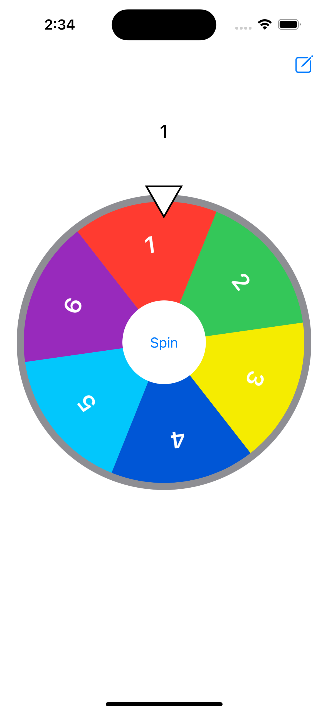
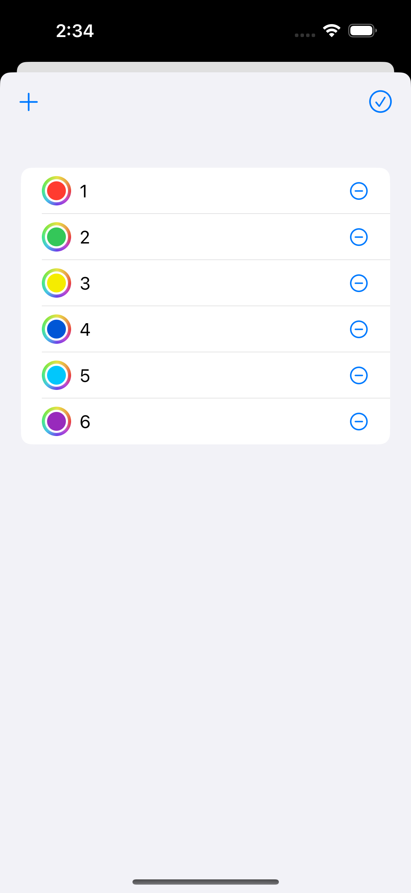

# RandomWheel

This is an iOS application developed using SwiftUI, providing a customizable spinning wheel that allows users to create a list of multiple options and randomly select an item by spinning the wheel.

## ScreenShots

## Features

* Displays a sector-based wheel with customizable text and colors.
* Add, edit, and delete options with customizable text and color.

## Requirements

* iOS 17.6 or later

## License

Distributed under the [MIT](LICENSE) License.
